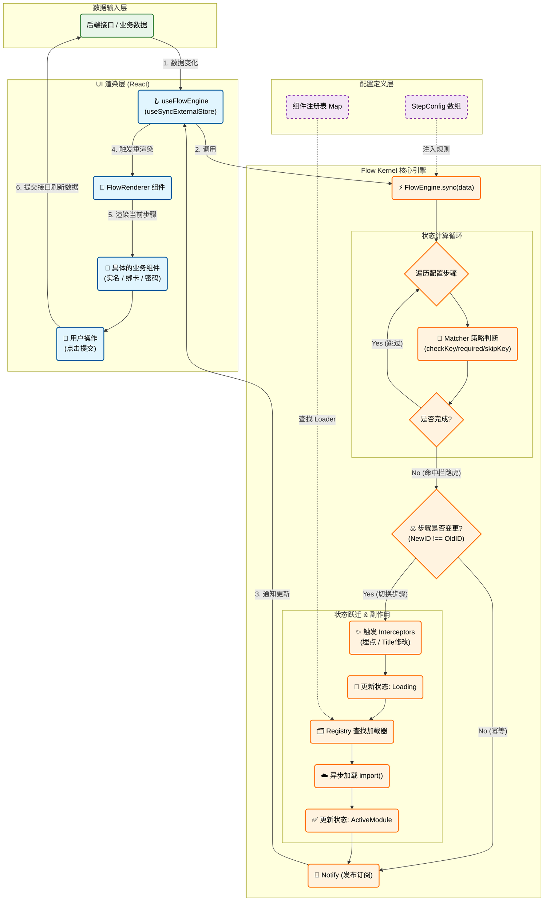

涵盖了从 **数据输入** -> **引擎计算** -> **资源加载** -> **状态分发** -> **UI 渲染** 的全过程。

### 📊 完整架构逻辑流程图

---

### 🗺️ 图解说明

这张图分为四个核心纵队，展示了数据如何在系统中流转：

#### 1. 🟢 数据输入层 (Data Layer)

- **起点**：一切始于 `BackendAPI` 返回的数据（例如 `{ hasAuth: true, hasPwd: false }`）。
- **单一数据源**：前端不自己维护“当前是第几步”，完全由这份数据决定。

#### 2. 🟣 配置定义层 (Config Layer)

- **静态规则**：这里定义了流程的“地图”（`StepConfig`）和“武器库”（`Registry`）。
- **热插拔**：修改这里的 JSON 配置，就能改变下面内核的运行路径。

#### 3. 🟠 Flow Kernel 核心引擎 (The Brain)

这是最复杂的逻辑部分：

1. **Sync**: 接收数据，开始计算。
2. **Matcher Loop**: 贪婪匹配，一个个问 `Matcher`：“这一步做完了吗？”（结合 `required`, `skipKey`, `matcher` 函数判断）。
3. **Diff**: 找到第一个没做完的步骤，和当前步骤对比。如果一样，什么都不做（**幂等性**）。
4. **Transition**: 如果步骤变了：
   - 触发 **Side Effects** (拦截器/埋点)。
   - 去 **Registry** 找对应的代码加载器。
   - 执行 **Async Load** (Webpack 动态导入)。
   - 更新内部 State。
5. **Notify**: 拿着最新的 State，大喊一声“状态变啦！”

#### 4. 🔵 UI 渲染层 (UI Layer)

- **React Hook**: 听到引擎的喊声，触发 React 的 Re-render。
- **FlowRenderer**: 根据引擎给的 `ActiveModule`，把真正的组件画在屏幕上。
- **闭环**: 用户在组件里点击“提交”，调用 API，数据发生变化，**再次触发第一步**，形成完美的闭环。
